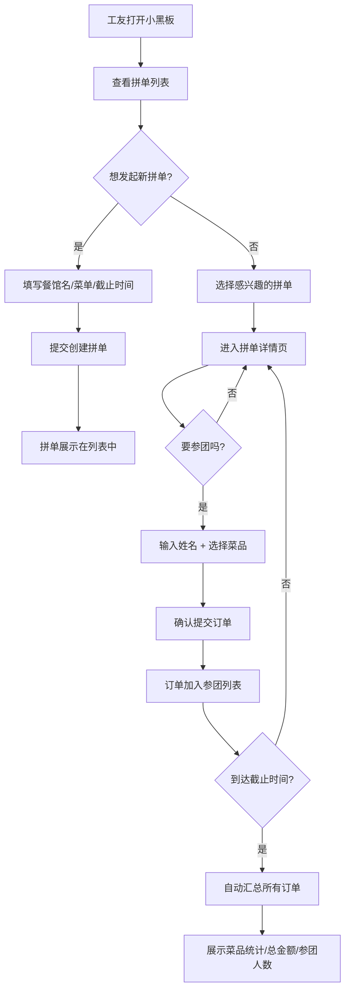

## 1. 产品概述

工地盒饭拼单小黑板是一款专为工地工友设计的午餐拼单协作工具，解决工友们中午凑单买盒饭时沟通混乱、统计困难的问题。工友可以发起拼单、选择餐馆、设置菜单和截止时间，其他工友一键参团并选择菜品，到时间自动汇总所有订单让所有人一目了然。

- 目标用户：工地工友、建筑工人、团队午餐拼单群体
- 核心价值：简化拼单流程、避免统计错误、节省沟通时间
- 产品定位：纯记录展示工具，无支付功能，轻量易用

## 2. 核心功能

### 2.1 用户角色
无需注册登录，纯本地使用，所有角色均为工友身份。

| 角色 | 身份说明 | 核心权限 |
|------|----------|----------|
| 拼单发起人 | 任何工友 | 发起拼单、编辑餐馆菜单、设置截止时间、关闭拼单 |
| 参团工友 | 任何工友 | 查看拼单、参团、选择菜品、修改自己的订单、查看汇总 |

### 2.2 功能模块
1. **首页/拼单列表页**：展示所有进行中和已结束的拼单、黑板风格展示、快速发起拼单入口
2. **发起拼单页**：填写餐馆名称、输入菜单菜品及价格、设置拼单截止时间、发起人姓名
3. **拼单详情页**：展示拼单信息、参团列表、我要参团按钮、选择菜品、订单汇总展示、倒计时

### 2.3 页面详情
| 页面名称 | 模块名称 | 功能描述 |
|----------|----------|----------|
| 拼单列表页 | 黑板标题区 | 粉笔字风格大标题"今日拼单小黑板"、日期显示 |
| 拼单列表页 | 拼单卡片列表 | 展示每个拼单的餐馆名、发起人、截止倒计时、参团人数、状态标签 |
| 拼单列表页 | 发起拼单按钮 | 醒目的粉笔按钮，点击跳转发起拼单页 |
| 发起拼单页 | 拼单信息表单 | 餐馆名称输入、发起人姓名输入、截止时间选择 |
| 发起拼单页 | 菜单编辑区 | 动态添加/删除菜品（菜名+价格），支持批量输入 |
| 发起拼单页 | 预览与提交 | 预览菜单、确认提交按钮 |
| 拼单详情页 | 拼单信息展示 | 餐馆名、发起人、截止倒计时、剩余时间进度条 |
| 拼单详情页 | 菜单列表 | 展示所有可选菜品及价格，点击选择 |
| 拼单详情页 | 参团/点单区 | 输入姓名参团、选择菜品数量、确认提交我的订单 |
| 拼单详情页 | 已参团列表 | 展示每位参团工友的姓名和所选菜品明细 |
| 拼单详情页 | 订单汇总区 | 自动统计每种菜品的总数量、总金额、参团人数 |

## 3. 核心流程

工友小王中午想发起拼单，他打开小黑板，点击"发起拼单"，输入"老王家盒饭"作为餐馆名，添加菜品（红烧肉饭15元、番茄炒蛋饭12元、酸辣土豆丝饭10元），设置截止时间为11:30，提交后拼单创建成功。工友小李、小张、老赵陆续看到拼单，分别点击"我要参团"，输入自己的名字并选择想吃的菜品。到11:30时，拼单自动截止，页面展示完整的订单汇总：红烧肉饭x3、番茄炒蛋饭x2、酸辣土豆丝饭x1，总计79元，参团人数6人。小王照着汇总去餐馆点餐即可。

## 4. 用户界面设计

### 4.1 设计风格
- **主色调**：深墨绿色（黑板色 #1e3a2f）作为背景，米黄色粉笔色（#f5e6c8）作为文字主色，橙红色（#e8734a）作为强调色
- **次色调**：淡绿色（#a8c5a0）作为次要文字，浅棕色（#8b6f47）作为装饰线条
- **按钮风格**：粉笔质感矩形按钮，圆角4px，按压有粉笔灰散落动效
- **字体**：标题使用手写粉笔字体风格，正文使用清晰易读的无衬线字体，字号偏大保证工地户外可读性
- **布局风格**：黑板背景 + 木框装饰，卡片采用便签纸/粉笔字风格，整体像一块真实的工地小黑板
- **图标风格**：简单线条粉笔图标，使用 🍱 📋 ⏰ 👷 ✏️ 等emoji增强亲切感

### 4.2 页面设计概述
| 页面名称 | 模块名称 | UI元素 |
|----------|----------|--------|
| 拼单列表页 | 黑板标题区 | 大粉笔字标题、木框边框、粉笔灰颗粒纹理背景、日期便签贴纸 |
| 拼单列表页 | 拼单卡片 | 粉笔字内容、胶带贴纸效果、状态标签（进行中绿色/已结束灰色）、倒计时数字 |
| 拼单列表页 | 发起按钮 | 橙红色粉笔按钮、"+ 发起拼单"粉笔字、悬停微微晃动 |
| 发起拼单页 | 表单区域 | 粉笔字标签、横线输入框（像黑板上写字）、菜品动态增删行 |
| 发起拼单页 | 菜单输入 | 每行菜名+价格输入框、删除按钮、添加新菜品按钮 |
| 拼单详情页 | 头部信息 | 餐馆名大号粉笔字、发起人便签、倒计时大数字+进度条 |
| 拼单详情页 | 菜单选择 | 菜品卡片（菜名/价格）、点击选中高亮粉笔圈、数量加减按钮 |
| 拼单详情页 | 参团列表 | 每个工友一张小便签，黄色/粉色/蓝色交替、内容为姓名+菜品 |
| 拼单详情页 | 订单汇总 | 底部粉笔框区域、统计表、合计金额大字突出 |

### 4.3 响应式
采用移动端优先设计，同时适配桌面端：
- 手机端：单列布局，大按钮大字体，适合单手操作
- 平板/桌面：保持黑板风格，最大宽度限制在800px居中展示，模拟真实黑板比例
- 触控优化：所有可点击区域≥48px，按钮间距充足，避免误触

### 4.4 动效设计
- 页面进入：粉笔字逐字书写动画
- 按钮悬停：粉笔灰微微散落、按钮轻微上浮
- 卡片点击：便签纸微微翘起、阴影变化
- 倒计时：数字翻牌效果，最后5分钟变橙红色闪烁警示
- 订单汇总展示：数字从0滚动到实际数量，有累加动效
