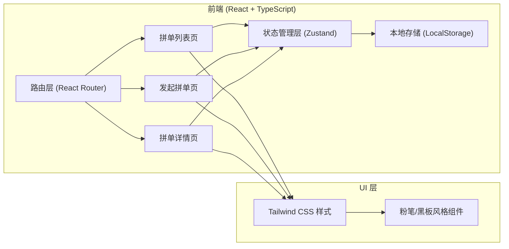
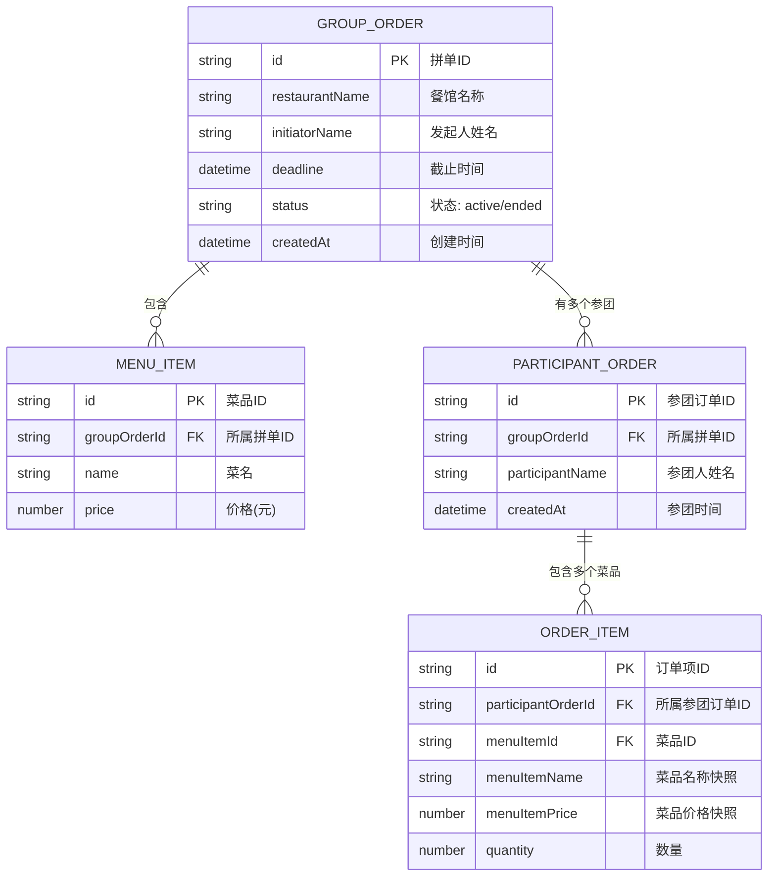

## 1. 架构设计



纯前端单页应用，无需后端服务，数据持久化通过浏览器 LocalStorage 实现。

## 2. 技术描述

- **前端框架**：React@18 + TypeScript
- **构建工具**：Vite@5
- **样式方案**：Tailwind CSS@3（自定义黑板/粉笔主题配置）
- **状态管理**：Zustand（轻量级store，管理拼单数据、参团数据）
- **路由管理**：React Router DOM@6
- **图标库**：Lucide React
- **数据存储**：浏览器 LocalStorage（JSON序列化存储拼单和订单数据）
- **项目模板**：react-ts（纯前端项目，无后端）

## 3. 路由定义

| 路由路径 | 页面组件 | 页面用途 |
|----------|----------|----------|
| `/` | OrderListPage | 拼单列表首页，展示所有拼单 |
| `/create` | CreateOrderPage | 发起新拼单表单页 |
| `/order/:id` | OrderDetailPage | 拼单详情页，参团点单、查看汇总 |
| `*` | OrderListPage | 404重定向到首页 |

## 4. 数据模型

### 4.1 数据模型定义



### 4.2 TypeScript 类型定义

```typescript
interface MenuItem {
  id: string;
  name: string;
  price: number;
}

interface OrderItem {
  id: string;
  menuItemId: string;
  menuItemName: string;
  menuItemPrice: number;
  quantity: number;
}

interface ParticipantOrder {
  id: string;
  participantName: string;
  items: OrderItem[];
  createdAt: string;
}

interface GroupOrder {
  id: string;
  restaurantName: string;
  initiatorName: string;
  deadline: string;
  status: 'active' | 'ended';
  menu: MenuItem[];
  participants: ParticipantOrder[];
  createdAt: string;
}

interface GroupOrderStore {
  orders: GroupOrder[];
  createOrder: (data: Omit<GroupOrder, 'id' | 'status' | 'participants' | 'createdAt'>) => string;
  addParticipant: (orderId: string, participant: Omit<ParticipantOrder, 'id' | 'createdAt'>) => void;
  endOrder: (orderId: string) => void;
  getOrderById: (id: string) => GroupOrder | undefined;
}
```

## 5. 目录结构

```
src/
├── components/           # 可复用组件
│   ├── Blackboard.tsx        # 黑板容器组件
│   ├── ChalkButton.tsx       # 粉笔风格按钮
│   ├── ChalkInput.tsx        # 粉笔输入框
│   ├── CountdownTimer.tsx    # 倒计时组件
│   ├── OrderCard.tsx         # 拼单卡片
│   ├── StickyNote.tsx        # 便签纸组件
│   └── MenuItemSelector.tsx  # 菜品选择器
├── pages/                # 页面组件
│   ├── OrderListPage.tsx     # 拼单列表页
│   ├── CreateOrderPage.tsx   # 发起拼单页
│   └── OrderDetailPage.tsx   # 拼单详情页
├── store/                # 状态管理
│   └── useOrderStore.ts      # Zustand store
├── types/                # TypeScript类型
│   └── index.ts
├── utils/                # 工具函数
│   ├── id.ts                 # ID生成器
│   ├── storage.ts            # LocalStorage封装
│   └── time.ts               # 时间格式化
├── App.tsx               # 根组件（路由配置）
├── main.tsx              # 入口文件
└── index.css             # 全局样式（Tailwind + 粉笔主题）
```
